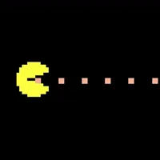
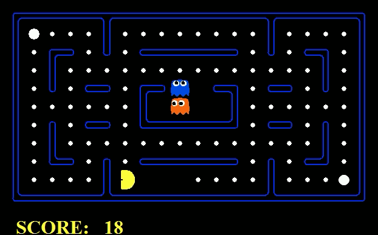

<h1 align="center">Pacman Alpha-Beta Pruning🎮
    
</h1>

<h4 align="center" id="about">
A Pacman  🎮 AI that uses Minimax with Alpha-Beta pruning to play Pacman. This project was done as part of the Artificial Intelligence course at the Lebananese American University.
We implmented, minimax, expectimax, and alpha-beta pruning. We also implemented a better evaluation function for the pacman game.
</h4>

 

  

 

<h2 align="left">
Table of Contents 📚
<ul>
</h2>
<li><a href="#about">About</a></li>
<li><a href="#alphabeta">Alpha Beta Prunning</a></li>
<li><a href="#simulated-annealing">How we used same concept of simulated annealing</a></li>
<li><a href="#evaluation-function">Evaluation Function</a></li>
<li><a href="#contributors">Contributors</a></li>
<li><a href="#license">License</a></li>

<h2 align="left" style="display:flex;align-items:center;justify-items:center;gap: 2rem" id="alphabeta">Expectimax
    
</h2>

Alpha Beta Pruning is a search algorithm that seeks to decrease the number of nodes that are evaluated by the minimax algorithm in its search tree. It is an adversarial search algorithm used commonly for machine playing of two-player games (Tic-tac-toe, Chess, Go, etc.). It stops evaluating a move when at least one possibility has been found that proves the move to be worse than a previously examined move. Such moves need not be evaluated further. When applied to a standard minimax tree, it returns the same move as minimax would, but prunes away branches that cannot possibly influence the final decision.
 We implemented alpha beta prunning in the file <code>multiAgents.py</code> under the class <code>AlphaBetaAgent</code>

 
 

<h2 align="left" id="simulated-annealing">
How we used same concept of simulated annealing 🔥
</h2>

We noticed that pacman was not exploring and instead stopping when states have equal values.
 
We create a variable <code>self.temprarure</code> that is initialized to 1 and is decreased by 0.001 every time we call `getAction` function.
 
Then if pacman is considering action <code>STOP</code> we reduce the value of that state by a <code>reduceAmount</code>. Such that:
<pre lang="python">
x = (self.temperature - 0.5) *12
</pre>
<pre lang="python">
s = 1 / (1 + math.exp(-x))
</pre>
<pre lang="python">
reduce_amount = s* 0.9 + 0.1
</pre>
<pre lang="python">
successorValue *= reduce_amount
</pre>

This will make pacman Explore more at the beginning of the game and then stop exploring (rather exploit) as the game progresses.

 
 

<h2 align="left" id="evaluation-function">
Evaluation Function 📊
</h2>

First, we extract features from the current game state. Those features are:

- feat_FoodCount: the number of food left on the board
 
 
- feat_DClosestFood: the distance to the closest food
  - Here we use the foodHeuristic function to actually calculate the distance to the closest food using manhattan distance
  - We also check if there is a ghost nearby, if so we return a very high number to avoid it, meaning that no need to risk going for the close food if there is a ghost nearby
  - The returned value is normalized by the maximum distance possible on the board ((maximum_distance - closest_food) / maximum_distance)
  - Then we use math.exp(feat_DClosestFood) to make changes in the distance more sensitive
 
 
- feat_currentScore: the current score of the game
 
 
- feat_isNearGhost: a boolean value (0 or 1) indicating if there is a ghost nearby
  - It works by first using manhattan distance to check if there is a CHANCE that there is a ghost nearby
  - If there is a chance, we use A* to validate that indeed there is a ghost nearby

Then, we use the weights to calculate the score of the current game state.

We used a Genetic Algorithm to find the best weights for the features.

- How it works:
  - We start with a random population of weights, each chromosome is a list of 4 weights <code>[w1, w2, w3, w4]</code> where <code>wi</code> is a random number between -2000 and 2000
  - We then calculate the fitness of each chromosome by running the game 1 time and returning the final game score as the fitness of that chromosome
  - We used ranking selection to select the best chromosomes to be the parents of the next generation
  - We used 80% probabilty for crossover and 35% probabilty for mutation
  - We keep 2 elites from each generation to speedup convergence and not lose valuable weights
- How to run the GA:
  - First

        pip install requirements.txt

  - Then run

        python genetic_algorithm.py -l smallClassic -p AlphaBetaAgent -k 10

  - <code>l</code> is the layout of the game
  - <code>p</code> is the agent to use
  - <code>k</code> is the number of ghosts

We multiply each feature by its weight and sum them up to get the score of the current game state
then return that score

 

<h1 id="contributors">Contributors 📖</h1>

<ul>
<li>Charbel Fayad - charbel.fayad01@lau.edu - 202102394</li>
<li>Manel Roumaissa Benabid - manelroumaissa.benabid@lau.edu - 201906232</li>
</ul>

<h1 id="license">License 📄</h1>

This project is licensed under the MIT License - see the <a href="MIT License">LICENSE.md</a> file for details
